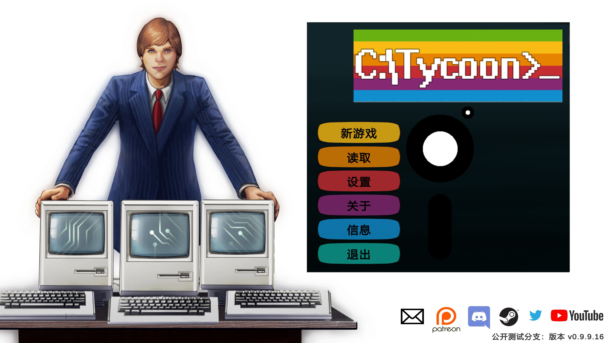
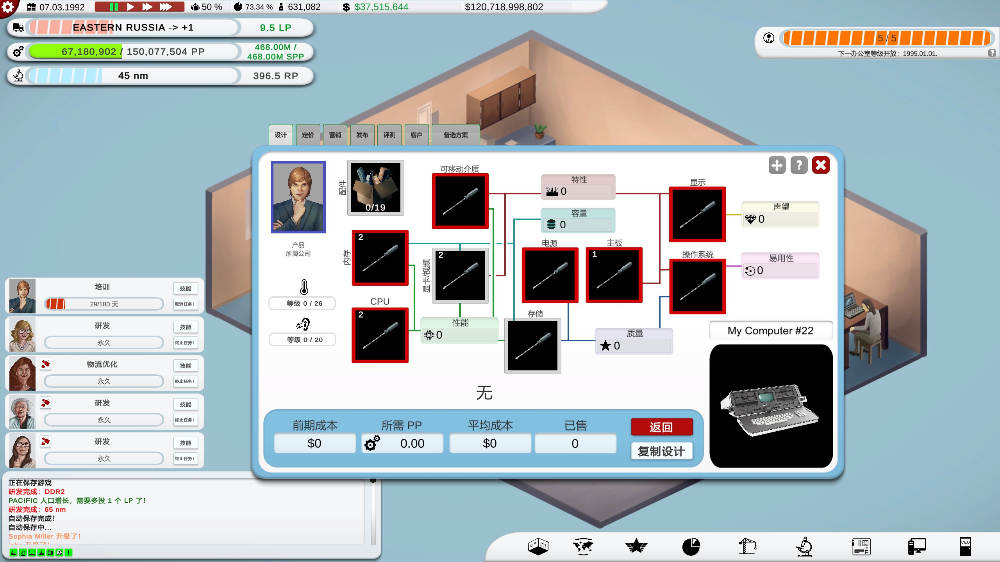

# Computer Tycoon 简体中文汉化补丁（非官方）

为 Steam 游戏 [Computer Tycoon](https://store.steampowered.com/app/686680/Computer_Tycoon/)（Progorion LLC 开发）制作的免费简体中文汉化。解压即用，不修改任何游戏原始文件，删除即可恢复原版。

> 本项目为玩家自制的非官方汉化，与开发商 Progorion 无关。请支持正版。

[](https://github.com/tuyikai/ComputerTycoon-CN-Patch/releases/latest)

**下载**：[最新版本页面](https://github.com/tuyikai/ComputerTycoon-CN-Patch/releases/latest)｜[直接下载 v1.0.0 汉化包（38 MB）](https://github.com/tuyikai/ComputerTycoon-CN-Patch/releases/download/v1.0.0/ComputerTycoon-zh-v1.0.0.zip)




## 目录

- [功能](#功能)
- [安装](#安装)
- [卸载](#卸载)
- [常见问题](#常见问题)
- [工作原理](#工作原理)
- [参与翻译](#参与翻译)
- [从源码编译插件](#从源码编译插件)
- [致谢与许可](#致谢与许可)
- [English](#english)

## 功能

- 约 4,400 条界面与剧情文本的简体中文翻译，另有约 140 条动态文本规则（带数字、人名、公司名、国家名的句子），覆盖：主菜单与设置、教程与顾问提示、CEO 谈判对话、随机事件、硬件与技术说明、市场与财务界面、法律诉讼、成就等。
- 按电脑发展史的语境统一术语（托架、软驱、总线、芯片组、倍频、便携电脑、工作站等），型号与代号保留原文，不会出现「286 个 CPU」这类机翻。
- 自制字体插件 `CTCJKFontFix`：游戏本身的字体不含汉字，插件在运行时用 Windows 自带的微软雅黑生成后备字体，中文正常显示。
- 加载画面右下角显示汉化水印（可修改或关闭）。
- 完全离线运行，不联网，不调用任何在线翻译服务。

## 安装

**系统要求**：Windows 10 或 11（64 位），Steam 正版 Computer Tycoon。

1. 到本仓库的 [Releases](../../releases) 页面下载 `ComputerTycoon-zh-v1.0.0.zip`（在页面的 Assets 里），或直接点上方的「直接下载」链接。**不要**下载 Source code，那是源码，不是汉化包。
2. 在 Steam 库中右键 Computer Tycoon，选择「管理」，再选「浏览本地文件」，打开游戏文件夹。
3. 把压缩包里的**所有内容**直接解压到游戏文件夹（与 `Computer Tycoon.exe` 同一层），遇到同名文件选择「替换」。
4. 从 Steam 正常启动游戏。

**首次启动会黑屏或卡住 1 到 2 分钟**，这是 BepInEx 在根据你的游戏版本生成必要文件，属于正常现象，请耐心等待。以后启动就是正常速度。

安装正确时，游戏文件夹里应能看到以下内容：

```
Computer Tycoon/
├── BepInEx/
├── dotnet/
├── winhttp.dll
├── doorstop_config.ini
├── .doorstop_version
├── Computer Tycoon.exe
└── ……（游戏原有文件）
```

## 卸载

在游戏文件夹中删除以下内容即可恢复原版：

`BepInEx` 文件夹、`dotnet` 文件夹、`winhttp.dll`、`doorstop_config.ini`、`.doorstop_version`、`changelog.txt`

如有疑虑，可在 Steam 中右键游戏，选择「属性」、「已安装文件」、「验证游戏文件的完整性」。

## 常见问题

**进游戏还是英文？**
检查 `BepInEx` 文件夹和 `winhttp.dll` 是否直接位于游戏根目录，而不是多套了一层文件夹。在游戏中按 `Alt + T` 可以开关翻译，确认没有误关。

**中文显示成方框？**
汉化依赖 Windows 自带的「微软雅黑」字体（`C:\Windows\Fonts\msyh.ttc`），Windows 10 和 11 均自带。如仍显示方框，请提交 Issue 并附上 `BepInEx\LogOutput.log`。

**读档时为什么会先显示几秒英文？**
这是有意为之。游戏在加载存档时会读取部分界面文字作为数据，若此时界面是中文，读档后游戏日期会错误地变成 01.01.1970。因此插件在加载画面期间自动暂停翻译，进入游戏约 2 秒后自动恢复中文。

**有些地方还是英文？**
少数文字是有意保留英文的：人名、公司名、产品型号、恶搞游戏名，以及 C64 风格的磁带加载画面（复古彩蛋，而且翻译它会导致开新局卡在加载界面）。其余漏翻的地方欢迎截图提交 Issue。

**如何修改或关闭水印？**
用记事本打开 `BepInEx\config\yikai.ct.cjkfontfix.cfg`：

```ini
[Watermark]
Enabled = true
Text = 简体中文汉化 by Yikai（非官方汉化，免费分享）
FontSize = 26
Color = #C8C8FF

[Fixes]
PauseTranslationWhileLoading = true
OnlyFirstLoad = false
ResumeDelaySeconds = 2
```

- `Enabled` 改为 `false` 即可关闭水印，`Text` 可改成你想显示的文字。
- `[Fixes]` 下的三项用于避免读档日期出错，建议保持默认：不要关闭 `PauseTranslationWhileLoading`，不要开启 `OnlyFirstLoad`，`ResumeDelaySeconds` 不要低于 2。

**游戏更新后汉化失效？**
一般重启一次游戏即可，BepInEx 会自动重新生成所需文件。仍不行的话重新解压一次汉化包。

## 工作原理

汉化不修改游戏文件，而是在游戏运行时替换屏幕上的文字：

| 组件 | 作用 |
|---|---|
| [BepInEx 6](https://github.com/BepInEx/BepInEx)（Unity IL2CPP 版，be.788） | Unity 游戏的插件加载框架 |
| [XUnity.AutoTranslator](https://github.com/bbepis/XUnity.AutoTranslator)（5.6.x） | 拦截游戏界面文字，按翻译文件替换成中文 |
| `CTCJKFontFix`（本项目） | 生成中文后备字体、显示加载水印、加载期间暂停翻译 |
| `CT_zh.txt`（本项目） | 翻译文件，`英文原文=中文译文` 的纯文本对照表 |

游戏基于 Unity 6（6000.0.38）并以 IL2CPP 编译，打包时裁剪了读取外部字体包的功能，因此 XUnity 自带的字体替换方案无法使用，需要 `CTCJKFontFix` 改用 TextMeshPro 的接口从系统字体文件直接生成字体。

## 参与翻译

翻译文件位于 [`translation/CT_zh.txt`](translation/CT_zh.txt)，格式如下：

```
// 以 // 开头的行是注释
Site Sold=出售场地
Hello\nWorld=你好\n世界
r:"^Frequency: ([0-9][0-9,\.]*) (KHz|MHz|GHz)$"=频率：$1 $2
```

- 每行一条，`=` 左边是游戏中的英文原文（必须完全一致，包括空格和换行 `\n`），右边是译文。原文中的 `=` 要写成 `\=`。
- `r:"正则"=替换` 用于带数字或名字的动态文本，`$1`、`$2` 代表括号里匹配到的内容，`$$` 代表美元符号。
- 术语请参考文件中已有的译法，保持一致；称呼玩家用「你」。

**注意事项（踩过的坑）：**

- **不要写「原样输出」的条目或规则**，例如 `X=X` 或 `r:"^(...)$"=$1`。插件一旦接管某个文字控件，游戏之后用它无法拦截的方式更新这个控件时，插件会把旧值写回去（实际案例：读档后日期停在 01.01.1970）。
- **不要翻译 C64 磁带加载画面**（以 `FOUND COMPUTER TYCOON` 或 `**** COMMANDOR 64` 开头的文字），游戏会读回这段文字判断加载进度，翻译后开新局会卡在 103%。
- **不要翻译存档列表**（`存档名   -   日期 时间`），游戏会用这段文字查找存档文件，翻译后无法读档。

**收集漏翻文本**：把 [`config/AutoTranslatorConfig.dev.ini`](config/AutoTranslatorConfig.dev.ini) 改名为 `AutoTranslatorConfig.ini` 放入 `BepInEx\config\`。它会让插件请求一个不存在的本地地址，请求失败时会把未翻译的原文记入 `BepInEx\LogOutput.log`（搜索 `Failed: '`），但不会改动游戏中的任何文字。退出游戏后立即备份日志，下次启动会被覆盖。

**打包发布**：把 [`tools/CT_pack_tool`](tools/CT_pack_tool) 文件夹放进游戏根目录，双击 `一键打包汉化.bat`，会在桌面生成发布用的压缩包。脚本会自动排除 `interop`、`cache`、日志等由游戏生成或含个人信息的文件，并换上发布版配置。

## 从源码编译插件

需要 [.NET 6 SDK](https://dotnet.microsoft.com/download) 或更高版本，以及一份已安装 BepInEx 6 并至少启动过一次游戏的游戏目录（编译需要 `BepInEx\interop` 里生成的接口文件）。

```bash
cd plugin
dotnet build -c Release -p:GameDir="D:\STEAM\steamapps\common\Computer Tycoon"
```

把生成的 `CTCJKFontFix.dll` 放入 `BepInEx\plugins\`。

## 致谢与许可

- 游戏 Computer Tycoon 及其所有内容版权归 [Progorion LLC](https://www.progorion.com) 所有。
- [BepInEx](https://github.com/BepInEx/BepInEx)（LGPL-2.1）与 [XUnity.AutoTranslator](https://github.com/bbepis/XUnity.AutoTranslator)（MIT）为其各自作者的开源项目，发布包中按原许可附带。
- 翻译初稿由 AI 辅助完成，并结合电脑发展史语境逐条校对、在游戏中实测。难免有疏漏，欢迎通过 Issue 指正。
- 本仓库中的翻译文件与 `CTCJKFontFix` 插件源码以 [MIT 许可](LICENSE) 发布。

## English

**Unofficial Simplified Chinese translation for [Computer Tycoon](https://store.steampowered.com/search/?term=Computer%20Tycoon) by Progorion LLC.** This is a free fan project and is not affiliated with the developer. Please buy the game.

- **What it is**: about 4,400 translated strings plus about 140 regex rules for dynamic text, loaded at runtime through BepInEx 6 (IL2CPP) and XUnity.AutoTranslator. No game files are modified or redistributed.
- **Font**: the game's fonts have no CJK glyphs, and this Unity 6 IL2CPP build strips the AssetBundle loading that XUnity normally uses for font replacement. The included `CTCJKFontFix` plugin builds a TextMeshPro fallback font at runtime from the system font Microsoft YaHei.
- **Save loading**: the game reads back some UI text as data while loading a save. To keep the in-game date correct, the plugin pauses translation while the loading screen is visible and resumes it about 2 seconds later.
- **Install**: download the zip from [Releases](../../releases), extract everything into the game folder next to `Computer Tycoon.exe`, and launch from Steam. The first launch takes 1 to 2 minutes while BepInEx generates its files.
- **Translation**: the first draft was AI-assisted and then reviewed in-game with attention to computer-history terminology.
